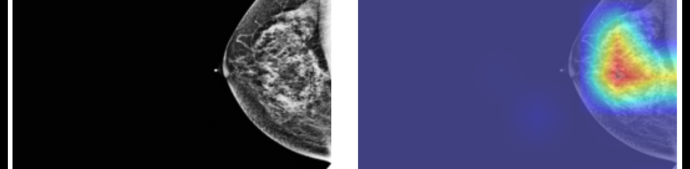

# ML-Algo Repository

This repository contains various components for a machine learning project focused on mammogram image processing and classification. Below is an overview of the different parts of the repository:

## Directory Structure

- **src**
    - Contains the main model code and subdirectories for different components.
    - Imports VGG16 and sets its default gradients to zero.
    - **training**
        - Contains the code for training, logging, and evaluating the model.
    - **data**
        - Contains the code for data preprocessing and loading.
    - **image_processing**
        - Contains the code for processing raw DICOM mammograms.
        - Converts DICOM images to JPEG.
        - Applies image processing techniques to remove text, noise, and inconsistencies from the mammograms.
     
      
        
        
    - **optuna**
        - Contains the code for experimenting with different hyperparameters using Optuna.

## Getting Started

To get started with this project, clone the repository and follow the instructions in each directory's README file.

```bash
git clone https://github.com/yourusername/ML-Algo.git
cd ML-Algo
```

## Dependencies

Make sure to install the required dependencies before running any code. You can find the list of dependencies in the `requirements.txt` file.

```bash
pip install -r requirements.txt
```

## Usage

### Model Code (src)

Navigate to the `src` directory to explore the model code. This includes importing the VGG16 model and setting its default gradients to zero.

### Training (training)

Navigate to the `training` directory to find the code for training the model, logging the training process, and evaluating the model's performance.



### Data Preprocessing (data)

Navigate to the `data` directory to find the code for data preprocessing and loading. This includes scripts for preparing the dataset for training.

### Image Processing (image_processing)

Navigate to the `image_processing` directory to find the code for processing raw DICOM mammograms. This includes converting DICOM images to JPEG and applying image processing techniques to clean the images.


## Contributing

Contributions are welcome! Please read the [CONTRIBUTING.md](CONTRIBUTING.md) file for guidelines on how to contribute to this project.

## License

This project is licensed under the GPL v3 License. See the [LICENSE](LICENSE) file for more details.
